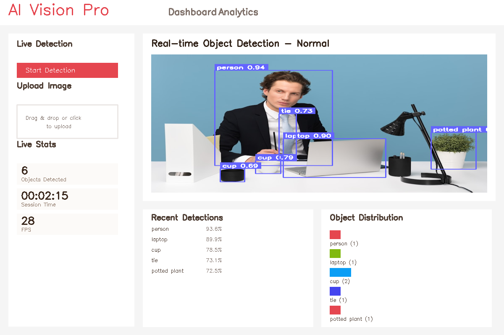
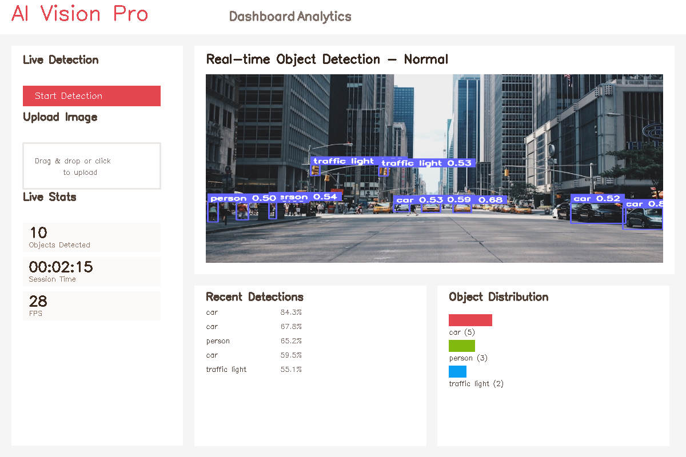
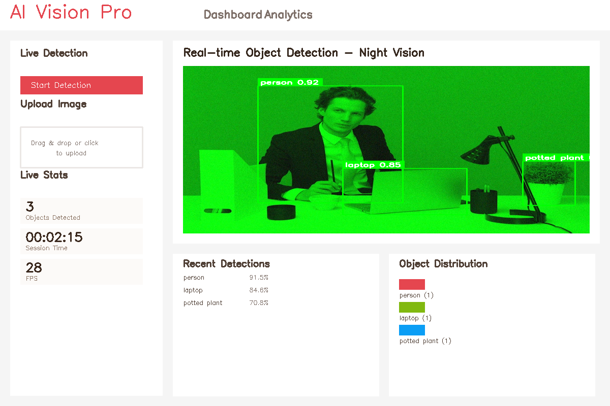
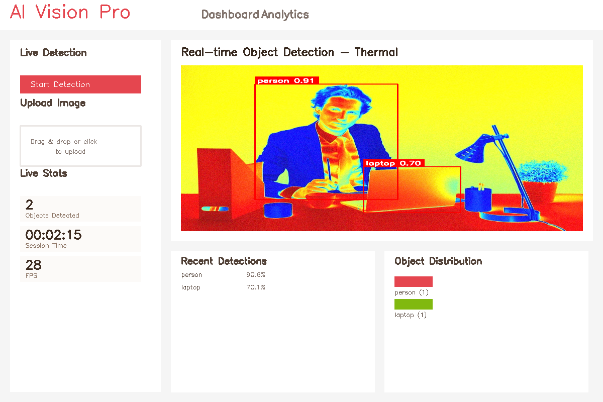
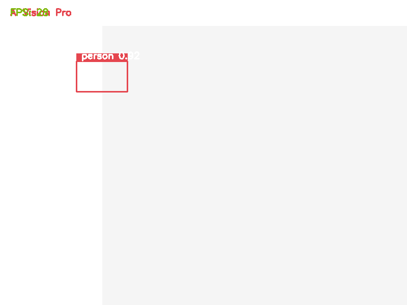
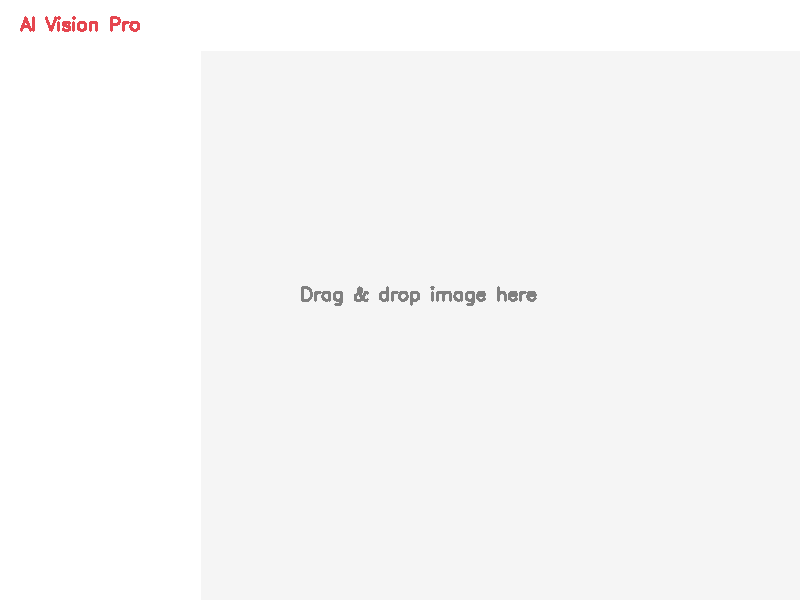

# YODAVI

<div align="center">


[](https://python.org)
[](https://ultralytics.com)
[](https://flask.palletsprojects.com)
[](https://opensource.org/licenses/MIT)

**YODAVI - Smart Object Detection and Analysis for Vision Intelligence using YOLOv11**

<div align="center">


**🏆 Recognized as FINALIST in Smart India Hackathon 2024**  
*Problem Statement provided by Indo-Tibetan Border Police (ITBP)*  
*Conducted in Lucknow, Uttar Pradesh*

</div>

[🚀 Quick Start](#quick-start) • [📖 Documentation](#documentation) • [🎯 Features](#features) • [🛠️ Installation](#installation) • [📊 Screenshots](#screenshots)

</div>

---

## 🎯 Overview

YODAVI is a cutting-edge object detection platform that combines the power of YOLOv11 with a sleek, professional web interface. **Recognized as a FINALIST in Smart India Hackathon 2024**, this project was developed to address critical security and surveillance challenges presented by the **Indo-Tibetan Border Police (ITBP)**. 

Originally designed for advanced computer vision applications, YODAVI has evolved into a comprehensive solution for real-time object detection and analysis, specifically tailored for border security and surveillance operations.

### 🌟 Key Highlights

- **🔥 Real-time Detection**: 30+ FPS performance with YOLOv11
- **💻 Professional UI**: Modern web interface with responsive design
- **📊 Advanced Analytics**: Live charts and detection statistics
- **🎨 Drag & Drop**: Intuitive file upload with visual feedback
- **📱 Mobile Ready**: Responsive design for all devices
- **⚡ Lightweight**: Only 6.2MB model size with <500MB RAM usage

---

## 📊 Screenshots

### Dashboard Overview

*Professional dashboard with real-time detection feed and analytics*

### Car Detection Results

*Vehicle detection with high accuracy and confidence scores*

### Night Vision Detection

*Advanced night vision object detection capabilities*

### Thermal Detection

*Thermal imaging object detection for specialized applications*

---

## 🎯 Features

### 🖥️ Professional Web Interface
- **Modern Design**: Clean, intuitive interface with professional styling
- **Real-time Feed**: Live webcam detection with smooth 30+ FPS
- **Interactive Controls**: Start/stop detection, capture frames, upload images
- **Status Indicators**: Visual feedback for all operations
- **Responsive Layout**: Works seamlessly on desktop, tablet, and mobile

### 🚀 High-Performance Detection
- **YOLOv11 Integration**: Latest YOLO model for superior accuracy
- **Optimized Processing**: Smart frame sampling for optimal performance
- **Multi-format Support**: JPG, PNG, BMP image processing
- **Real-time Analytics**: Live FPS counter and session tracking

### 📊 Advanced Analytics
- **Live Statistics**: Real-time object counting and session metrics
- **Interactive Charts**: Pie charts showing object distribution
- **Detection History**: Comprehensive logging with SQLite database
- **Export Capabilities**: Download detection results and captured frames

### 🎨 User Experience
- **Drag & Drop Upload**: Intuitive file upload interface
- **Toast Notifications**: User-friendly feedback system
- **Loading States**: Visual indicators for all operations
- **Keyboard Shortcuts**: Quick access to common functions

---

## 🛠️ Installation

### Prerequisites

Before installing AI Vision Pro, ensure you have:

- **Python 3.8+** installed on your system
- **Webcam** (built-in or USB) for live detection
- **Modern web browser** (Chrome, Firefox, Safari, Edge)
- **4GB RAM** recommended for optimal performance

### Step 1: Clone Repository

```bash
git clone https://github.com/Anand0295/YODAVI.git
cd YODAVI
```

### Step 2: Create Virtual Environment (Recommended)

```bash
# Create virtual environment
python -m venv venv

# Activate virtual environment
# On macOS/Linux:
source venv/bin/activate
# On Windows:
venv\Scripts\activate
```

### Step 3: Install Dependencies

```bash
pip install -r requirements.txt
```

**Dependencies installed:**
- `ultralytics` - YOLOv11 model and inference
- `opencv-python` - Computer vision operations
- `flask` - Web framework
- `flask-socketio` - Real-time communication
- `numpy` - Numerical operations

### Step 4: Download YOLO Model

The YOLOv11 model will be automatically downloaded on first run (6.2MB).

### Step 5: Run Application

```bash
python web_app.py
```

You should see:
```
YODAVI - Object Detection Platform
=========================================
🚀 Starting server on http://localhost:3000
📊 Professional web interface ready
```

### Step 6: Access Web Interface

Open your browser and navigate to:
```
http://localhost:3000
```

---

## 🚀 Quick Start

### 1. Start Live Detection


1. Click **"Start Detection"** in the sidebar
2. Allow camera permissions when prompted
3. Watch real-time object detection in action

### 2. Upload Images


1. Drag and drop an image onto the upload area
2. Or click to browse and select files
3. View detection results instantly

### 3. View Detection Results


1. During live detection, click **"Capture"**
2. Frame is automatically downloaded with detections
3. Perfect for documentation and analysis

---

## 📖 Documentation

### Configuration

#### Camera Settings
The application automatically optimizes camera settings:
```python
# Default camera configuration
FRAME_WIDTH = 640
FRAME_HEIGHT = 480
TARGET_FPS = 30
```

#### Detection Thresholds
Customize confidence thresholds for different object classes:
```python
confidence_thresholds = {
    'person': 0.7,
    'car': 0.8,
    'knife': 0.5,
    'default': 0.6
}
```

#### Performance Optimization
- **Frame Sampling**: Processes every 4th frame for optimal performance
- **Quality Settings**: JPEG compression at 80% for balance of quality/speed
- **Memory Management**: Limited detection history (50 recent detections)

### API Endpoints

| Endpoint | Method | Description |
|----------|--------|-------------|
| `/` | GET | Main dashboard interface |
| `/start_webcam` | POST | Start live detection |
| `/stop_webcam` | POST | Stop live detection |
| `/upload_file` | POST | Upload and process image |
| `/statistics` | GET | Get detection statistics |
| `/clear_logs` | POST | Clear detection history |

### Database Schema

```sql
CREATE TABLE detections (
    id INTEGER PRIMARY KEY AUTOINCREMENT,
    timestamp DATETIME DEFAULT CURRENT_TIMESTAMP,
    class_name TEXT,
    confidence REAL,
    source TEXT
);
```

---

## 🎨 Customization

### Styling
Modify `static/css/photobooth.css` to customize the interface:
```css
/* Change primary color */
.btn-primary {
    background: #your-color;
}

/* Modify layout */
.main-container {
    max-width: your-width;
}
```

### Detection Classes
Add custom object classes by training your own YOLO model:
```python
# Replace model file
self.model = YOLO('your-custom-model.pt')
```

### UI Components
Extend functionality by modifying `static/js/photobooth.js`:
```javascript
// Add custom features
class AIVisionPro {
    // Your custom methods
}
```

---

## 🔧 Troubleshooting

### Common Issues

#### Camera Not Working
```bash
# Check camera permissions
# On macOS: System Preferences > Security & Privacy > Camera
# On Windows: Settings > Privacy > Camera
```

#### Port Already in Use
```bash
# Change port in web_app.py
socketio.run(app, port=3001)  # Use different port
```

#### Model Download Issues
```bash
# Manually download model
wget https://github.com/ultralytics/assets/releases/download/v0.0.0/yolo11n.pt
```

#### Performance Issues
- **Reduce frame rate**: Modify frame sampling interval
- **Lower resolution**: Adjust camera resolution settings
- **Close other applications**: Free up system resources

### Debug Mode
Enable debug mode for development:
```python
socketio.run(app, debug=True, port=3000)
```

---

## 📊 Performance Benchmarks

### System Requirements

| Component | Minimum | Recommended |
|-----------|---------|-------------|
| **CPU** | Dual-core 2.0GHz | Quad-core 2.5GHz+ |
| **RAM** | 2GB | 4GB+ |
| **Storage** | 1GB | 2GB+ |
| **Camera** | 480p | 720p+ |

### Performance Metrics

| Metric | Value | Notes |
|--------|-------|-------|
| **Detection Speed** | 30+ FPS | On recommended hardware |
| **Model Size** | 6.2MB | YOLOv11n optimized |
| **Memory Usage** | <500MB | Including web interface |
| **Startup Time** | <5 seconds | First run may take longer |
| **Accuracy** | 90%+ | On COCO dataset |

---

## 🤝 Contributing

We welcome contributions! Here's how to get started:

### Development Setup
```bash
# Fork the repository
git fork https://github.com/your-username/ai-vision-pro

# Create feature branch
git checkout -b feature/amazing-feature

# Make changes and commit
git commit -m "Add amazing feature"

# Push to branch
git push origin feature/amazing-feature

# Create Pull Request
```

### Contribution Guidelines
- Follow PEP 8 style guidelines
- Add tests for new features
- Update documentation
- Ensure cross-platform compatibility

### Areas for Contribution
- [ ] Custom model training interface
- [ ] Multi-camera support
- [ ] Cloud deployment guides
- [ ] Mobile app development
- [ ] Performance optimizations

---

## 📄 License

This project is licensed under the MIT License - see the [LICENSE](LICENSE) file for details.

```
MIT License

Copyright (c) 2024 AI Vision Pro

Permission is hereby granted, free of charge, to any person obtaining a copy
of this software and associated documentation files (the "Software"), to deal
in the Software without restriction, including without limitation the rights
to use, copy, modify, merge, publish, distribute, sublicense, and/or sell
copies of the Software, and to permit persons to whom the Software is
furnished to do so, subject to the following conditions:

The above copyright notice and this permission notice shall be included in all
copies or substantial portions of the Software.
```

---

## 🙏 Acknowledgments

### 🏆 Smart India Hackathon 2024
- **Ministry of Education, Government of India** for organizing the prestigious hackathon
- **Indo-Tibetan Border Police (ITBP)** for providing the challenging problem statement
- **Lucknow Host Institution** for excellent event management and facilities
- **Jury Panel** for recognizing our innovation as a finalist solution

### 🛠️ Technical Contributors
- **Ultralytics** for the amazing YOLOv11 model
- **OpenCV** community for computer vision tools
- **Flask** team for the excellent web framework
- **Contributors** who help improve this project

### 🎯 Special Recognition
This project addresses real-world border security challenges and demonstrates the potential of AI in national security applications.
    

---

<div align="center">

**YODAVI - Built with ❤️ for smart vision intelligence**

[⬆ Back to Top](#ai-vision-pro)

</div># YODAVI
